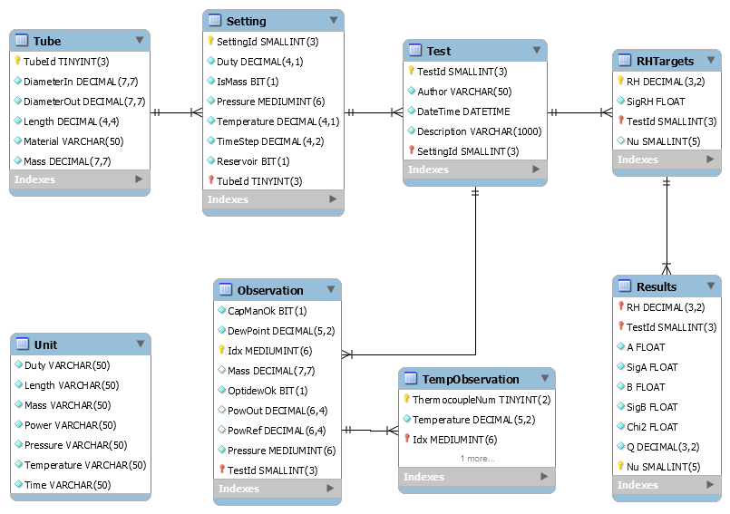
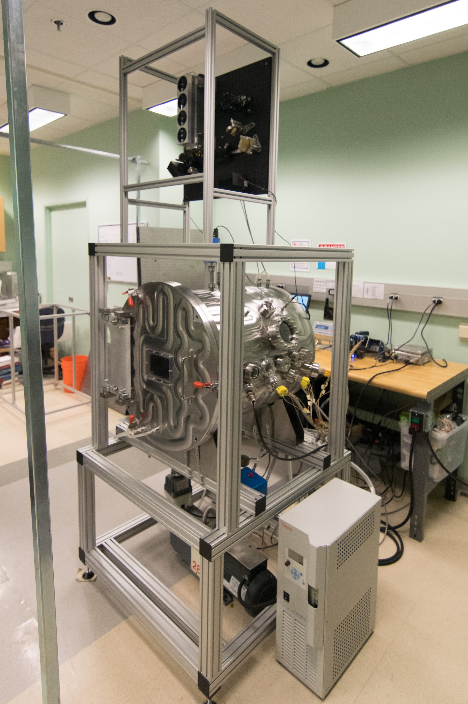
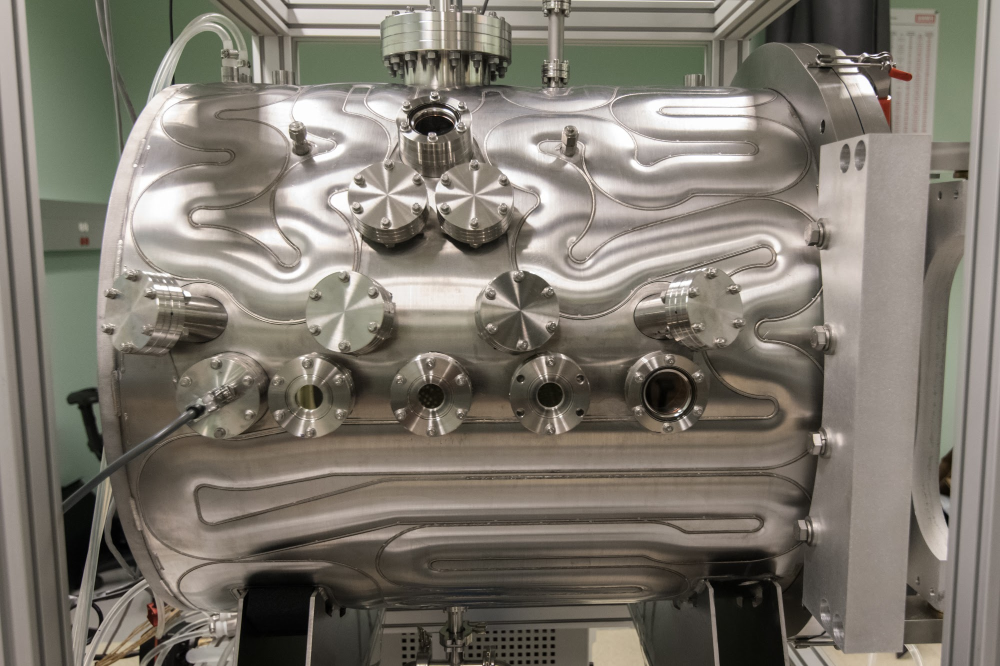
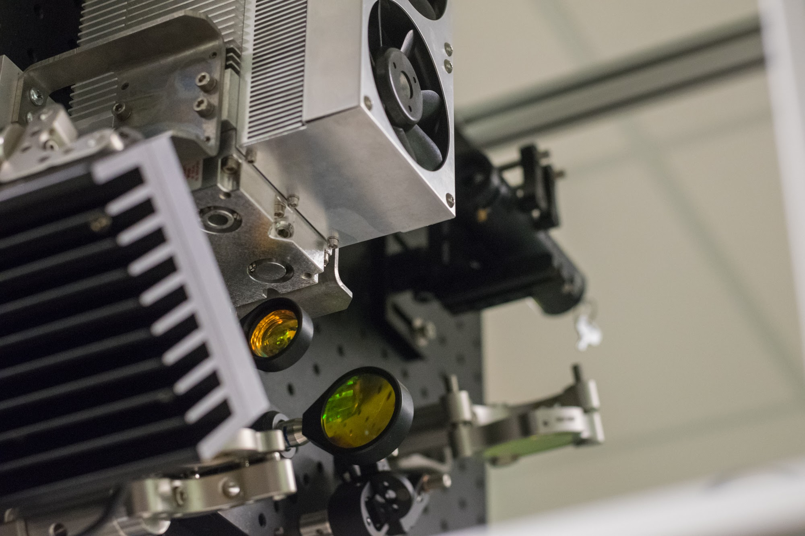

UCSD Coimbra Chamber
====================

|docs| |build|

Table of Contents
-----------------

  * `Description`_
  * `Python Version`_
  * `Documentation`_
  * `Dependencies`_
  * `Setting up Initial State of MySQL Database`_
  * `Preferred Way to Run Tests`_
  * `Preferred Way to Run Scripts`_
  * `Images`_

Description
-----------

Back to `Table of Contents`_

Description will go here.

Make sure that you export your MySQLCredentials environment variable for
access
::

    $ export MySqlUserName=<user_name>
    $ export MySqlCredentials=<password>
    $ export MySqlHost=<host>

Python Version
--------------

Back to `Table of Contents`_

This module is intended to use Python 3.x.

Documentation
-------------

Back to `Table of Contents`_

For detailed documentaton head over to chamber.readthedocs.io_.

Dependencies
------------

Back to `Table of Contents`_

  * CoolProp.HumidAirProp.HAPropsSI (for humid air calculations)
  * matplotlib.pyplot
  * matplotlib.legend_handler.HandlerLine2D
  * mysql.connector (for access to MySQL databases)
  * nptdms (for interacting with LabVIEW TDMS files)
  * pandas (for loading data into DataFrames)
  * pytest (for testing)
  * pytz (for datetime testing)
  * schedule (for autonomous execution)
  * tabulate.tabulate (for table formatting)
  * tqdm (for progress bars)

Setting up Initial State of MySQL Database
------------------------------------------

Back to `Table of Contents`_

Setting up the initial state of the MySQL Server is handled by the
setup_sqldb.py file.
Simply run the following command from the root directory; e.g., ucsd_ch:
::

  $ python setup/setup_sqldb.py <database_name>

Where <database_name> is replaced with the name of the MySQL database schema.
This will create all tables and populate the Unit table and add Tube 1
(default tube used in experiments).

The database schema is described below:

Preferred Way to Run Tests
---------------------------

Back to `Table of Contents`_

1. From the repo directory; i.e., chamber
::

    $ python -m pytest tests -xv  --cov=chamber --cov-report html tests

The above line requires both `pytest` and `pytest-cov` are installed.

Preferred Way to Run Scripts
---------------------------

Back to `Table of Contents`_

1. From the repo directory; i.e., chamber
::

    $ python -m chamber.scripts.<yout-script-name>

It should also be noted that the `.py` is not required at the end of this line.

Images
------

Back to `Table of Contents`_

.. image:: images/chamber_scale.jpg

.. |docs| image:: https://readthedocs.org/projects/docs/badge/?version=latest
    :alt: Documentation Status
    :scale: 100%
    :target: https://chamber.readthedocs.io/en/latest/?badge=latest

.. |build| image:: https://travis-ci.com/rinman24/chamber.svg?branch=master
    :alt: Build Status
    :scale: 100%
    :target: https://travis-ci.com/rinman24/chamber

.. _chamber.readthedocs.io: http://chamber.readthedocs.io
